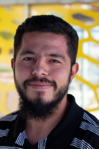

  
<h1 align="center"> Welcome </h1>

<p align="center">Previous to my endeavours as a software developer I was working in the automotive field where I do hold a degree and some certificates.
However, turning wrenches and busting knuckles isn't what I want to spend the rest of my times doing. I do enjoy getting my hands dirty from time to time but I would rather make money elsewhere and build up my own projects instead of building other peoples toys. For that very reason is why I have decided to change career paths. With my love of technology and need to learn something new, there was no need for second thoughts when coding was brought to the table and I was given the opportunity to join Deep Dive Coding. </p>

<p align="center">Coding is a passion I've had for quite some time but was afraid to take the risk, afraid I wasn't good enough. Now, I have spent the last few weeks learning to code at **Deep Dive Coding**, and I can't believe I have not taken the plundge into the depths sooner! While I haven't built anything completely spectacular at this point I'm having a blast destroying and fixing programs. However, I plan on focusing right now on learning the absolute basics and building a solid foundation on which I can really start to develope and create things I can love and or hate. Then figuring out exactly what I will apply my new found knowledge to will surely come easily after I get some very necessary basics covered. </p>

```
Some of the technologies I am currently learning and working with.

- Android
- GitHub
- Java
- Salesforce
```

```
Somethings I do while not in school coding.

- Code at home
- Spend time with my wife and three sons
- Attempt to code with my wife and three sons 
- Go to parks for picnics and recreation with the family
- Code at the park
- We go camping as much as time, weather and lack of laptop power will permit
- And coding in between all the tasks and events related  
- Also, enjoy reading and some occasional painting and drawing

```


Here is a link to my [GitHub](https://github.com/adulgr) where I save my class projects and other things I'm working on.

